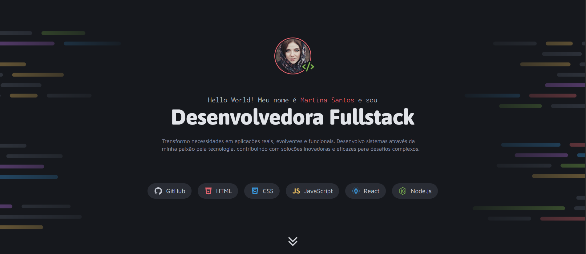

# 🚀 Desafio Rocketseat: Portfólio com HTML e CSS

Este repositório contém a entrega de um desafio proposto pela [Rocketseat](https://www.rocketseat.com.br/), com o objetivo de praticar **HTML5 e CSS3**, especialmente **layouts com Grid e Flex, além das utilizações de Column e Row**.

Apesar de ser um projeto fictício, ele representa uma etapa concreta da minha jornada de aprendizado — onde pude aplicar na prática vários conceitos que venho estudando com muita dedicação.

---

## ✨ O que foi desenvolvido

O desafio consistia em criar uma página de portfólio pessoal fictício com:

- Criação de layouts com CSS
- Posicionamento de elementos
- Variáveis CSS
- CSS Flexbox
- CSS Grid
- pseudo-class e pseudo-elements

O que eu entreguei nesse desafio:

- Estrutura semântica em HTML
- Layouts modernos com **Flexbox e Grid**
- Componentes reutilizáveis com classes
- Uso de **variáveis CSS**
- Design responsivo e acessível
- Estilo visual coeso e limpo

---

## 📁 Estrutura de seções

- **Sobre mim**: apresentação com imagem, título, descrição e tecnologias.
- **Projetos**: grid com 6 cards de projetos fictícios.
- **Serviços**: 3 blocos mostrando áreas de atuação (Frontend, Backend, DevOps).
- **Contato**: botões sociais com ícones e interações visuais.

---

## 🧠 Aprendizados pessoais

Esse projeto me ajudou a perceber como estou começando a entender **de verdade** os conceitos de layout, espaçamento, estruturação e responsividade.

> Mesmo quando parece que não sei, tenho estudado e tentado com consistência.  
> Cada pequena vitória aqui representa muito pra mim como desenvolvedora em formação.

---

## 📷 Preview

---

## 🔧 Tecnologias utilizadas

- HTML5
- CSS3 (com Grid, Flexbox e variáveis)
- Google Fonts

---

## 📥 Como visualizar

1. Clone este repositório:

   git clone https://github.com/LuciaAvilla/Portifolio-dev

2. Abra o arquivo index.html no navegador.

---

## 🤝 Créditos

Desafio por **Rocketseat.**

Implementado por mim com dedicação e vontade de aprender — um passo de cada vez. 💜

---

Feito com atenção, esforço e curiosidade.
✨ “Não precisa ser perfeito. Só precisa ser feito.” 🚀

